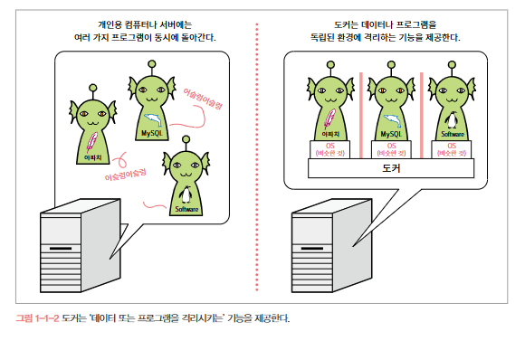
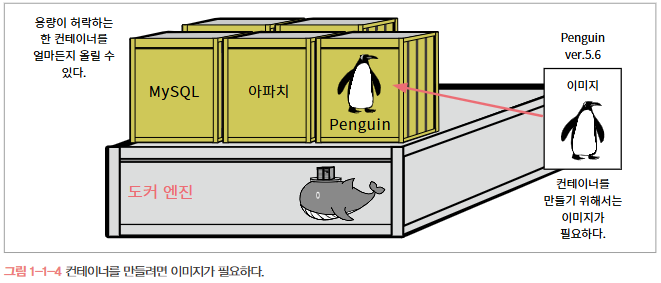
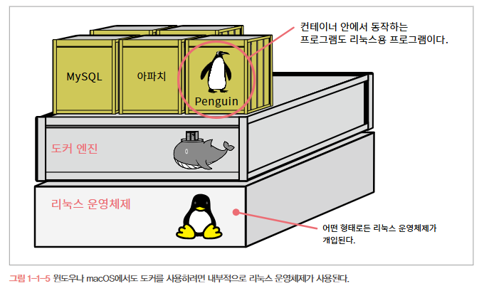
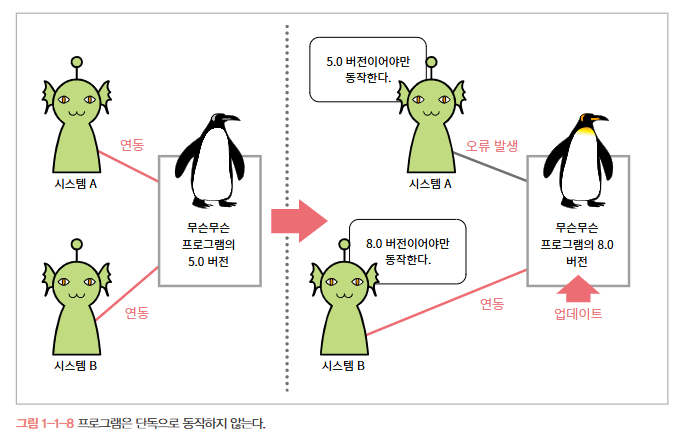
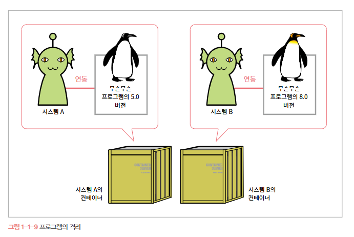
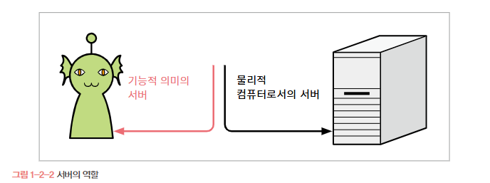
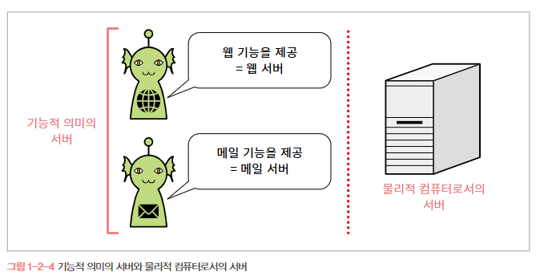
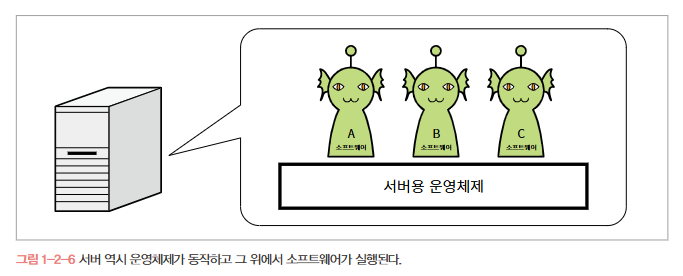

# 🐋 1. 도커란 무엇인가?

## 💡 도커란 무엇인가?
**데이터 또는 프로그램을 격리시키는 기능**을 제공하는 소프트웨어

### 🐬 컨테이너와 도커 엔진
개인용 컴퓨터 또는 서버 상의 환경을 마치 코스트코에서 판매하는 조립형 창고 같은 작은 방으로 분할하면? 그리고 이렇게 작게 쪼갠 독립된 창고에 데이터나 프로그램을 두는 것
- 이때 이 조립형 창고를 **컨테이너**
- 컨테이너를 다루는 기능을 제공하는 소프트웨어를 **도커**라고 한다.

### 🐬 컨테이너를 만들려면 이미지가 필요
컨테이너를 만들려면 컨테이너의 빵셔틀과 같은 **이미지**가 필요
- 담고 있는 소프트웨어의 종류에 따라 다양한 이미지를 사용
- 컨테이너는 용량이 허락하는 한 하나의 도커에서 여러 개를 만들 수 있다.

### 🐬 도커는 리눅스 컴퓨터에서 사용
도커는 몇가지 제약 사항이 있는데 
1. 종류와 상관없이 리눅스 운영체제가 필요
    - 윈도우나 macOS에서도 도커를 구동할 수는 있지만 이 경우 **내부적으로 리눅스가 사용된다.**
2. **컨테이너에서 동작시킬 프로그램도 리눅스용 프로그램**이다.

### 🐬데이터나 프로그램을 독립된 환경에 격리해야 하는 이유
대부분의 프로그램은 프로그램 단독으로 동작하는 것이 아니라 어떤 실행 환경이나 라이브러리, 다른 프로그램을 이용해 동작한다. 
- ex) PHP 프로그램 - PHP 실행환경

소프트웨어 역시 단일 프로그램이 아니라 여러 개의 프로그램으로 구성된 경우가 많다. 예를 들어, 워드프레스(WordPress)는 MySQL 데이터베이스를 따로 갖추지 않으면 사용할 수 없다.
또한 다른 프로그램과 특정한 폴더 또는 디렉터리를 공유하거나 같은 경로에 설정 정보를 저장하는 경우도 있음

이 때문에 프로그램 하나를 업데이트 하면 다른 프로그램에도 영향을 미친다.
공유하는 대상을 어느 한쪽만을 위해 수정하면 다른 쪽에서 오류가 발생한다.

이런 문제는 업데이트할 때만 발생하는 것이 아니다. 서버에서는 여러 프로그램이 함께 동작하므로 서버를 처음 구축할 때부터 신중하게 따져보지 않으면 안된다. 설계할 때는 문제가 없었던 프로그램끼리도 실제로 설치해보면 오류를 일으키는 경우가 있다. 
이러한 문제의 원인은 대부분 **프로그램 간 공유**에 있다.

프로그램에 따라서는 한 서버에 한 버전 밖에 설치할 수 없으므로 최소 버전을 같이 맞춰놓으면 문제가 되지 않는다.
그러나 신규 개발이라면 모를까, 기존 프로그램을 함께 설치하려는 상황이라면 연동 프로그램의 버전을 맞추지 못할 수도 있다.
디렉터리 역시 시스템 A, B가 같은 디렉터리를 사용하게 돼 있어서 설정 파일이 섞이거나 설정이 충돌이 발생할 수도 있다.

### 🐬 프로그램 격기란?
컨테이너 안에 들어있는 프로그램은 다른 프로그램과 격리된 상태이다.
도커 컨테이너를 사용해 프로그램을 격리하면 여러 프로그램이 한 서버에서 실행되면서 발생하는 문제를 대부분 해결할 수 있다.

## 💡서버와 도커

### 🐬 서버의 두 가지 의미
도커는 서버에서 사용되는 소프트웨어이다.  
클라이언트 컴퓨터에서도 사용할 수는 있지만 현시점에서는 서버에서 사용하는 것이 주 목적이라고 생각해도 좋다. 그렇다면 서버란?

🚨 **서버** : **어떤 서비스(service)를 제공(serve)하는 것**

### 🐬 기능적 의미의 서버와 물지적 컴퓨터로서의 서버
개발 현장에서 **서버**는 두 가지 의미를 갖는다. 한 가지는 **기능적 의미의 서버**이고 다른 한 가지는 **물리적 컴퓨터로서의 서버**를 가리킨다.

흔히 말하는 "웹 서버에 올려줘", "메일 서버가 죽었어" 등은 기능적 의미의 서버를 가르킨다. 
**'무슨무슨 서버'라는 말은 '무슨무슨 기능을 제공한다.'라는 의미**이므로 '웹 기능을 제공하는 서버'는 웹 서버이고 '메일 기능을 제공하는 서버'는 메일 서버가 됨

이와 달리 물리적 컴퓨터로서의 서버는 "신입 직원이 올 테니 책상 위의 서버 좀 취워라", "저번에 사장님이 서버에 꽃혀 있던 랜 케이블을 뽑았어" 같은 상황에서 가리키는 의미 즉, **실물**을 말한다.  
**데스크톱 컴퓨터와 마찬가지로 어딘가에 물리적으로 존재하는 컴퓨터**다.

이렇게 의미를 구분하는 이유? 

⚓ **하나의 '물리적 컴퓨터로서의 서버'에 여러 개의 '기능적 의미의 서버'를 함꼐 둘 수 있기 때문!!!**
 
일반적인 개인용 컴퓨터는 개인이 사용하지만 서버는 여러 사람이 원격으로 접근해서 사용한다는 점이 다르다.
물론 이러한 차이로 컴퓨터의 사양이나 요구사항이 달라짐  
하지만 우리가 쓰는 개인용 컴퓨터와 마찬가지로 운영체제가 동작하고 그 위에 소프트웨어를 실행하는 것은 동일

### 🐬 서버의 기능은 소프트웨어가 제공한다

### 🐬
### 🐬
