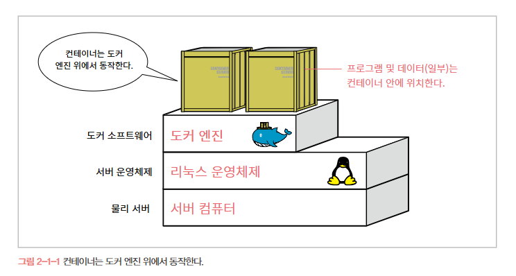
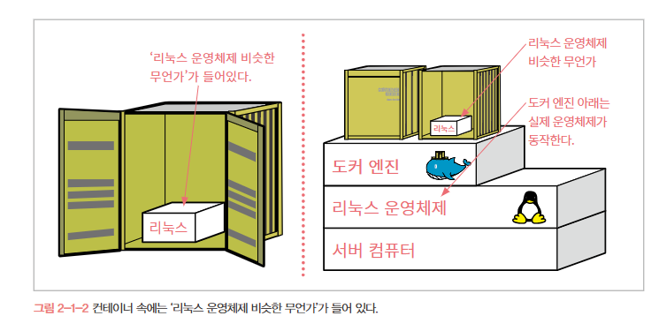

# 🐋 2. 도커의 동작 원리

## 💡도커의 동작 원리

### 🐬 도커의 구조
일반적인 서버 -> 운영체제 위에 프로그램이나 데이터가 직접 올라가지만
도커를 사용하는 경우 -> **운영체제 위에 도커 엔진이 동작하고 그 위에 컨테이너가 동작**한다. 프로그램이나 데이터는 컨테이너 안에 위치함

### 🐬 컨테이너 안에는 운영체제 '비스한 것'들이 들어있다.
**모든 컨테이너에는 '리눅스 운영체제 비숫한 무언가'가 들어있다.**

### 🐬 운영체제가 하는 일은 뭘까?
운영체제는 기본적으로 **소프트웨어나 프로그램의 명령을 하드웨어에 전달하는 역할**을 한다.

### 🐬 

### 🐬 

### 🐬 

### 🐬 

### 🐬 

### 🐬 

### 🐬 

### 🐬 

### 🐬 

### 🐬 

### 🐬 

### 🐬 

### 🐬 

### 🐬 

### 🐬 

