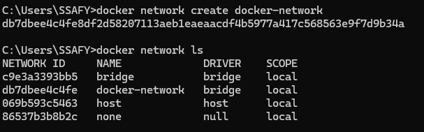
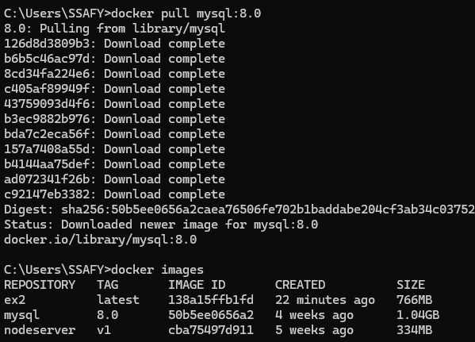
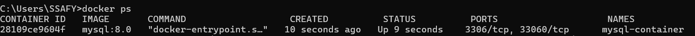
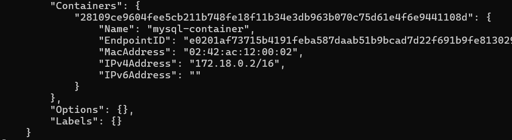

# Docker spring boot mysql 연동

Docker에서 spring boot 와 mysql을 연동하는 방법
도커에서 spring boot와 mysql을 연동하여 배포하려면 **spring boot 컨테이너**와 **mysql 컨테이너**가 각각 필요

두 컨테이너를 연동하는 방법
- 브릿지 네트워크 사용
- docker compose 사용
- host 네트워크 공유

나는 **브릿지 네트워크(bridge network)**를 생성해서 사용하는 방법을 다를 예정 (도커의 기본 네트워크 모드가 브릿지 네트워크)
- Docker 네트워크를 생성
- spring boot 이미지와 mysql 이미지를 해당 네트워크를 통해 실행하여 컨테이너를 생성

## 1.1 docker network 생성

```
docker network create docker-network
```
터미널 창에 **docker network create docker-network** 입력
- **docker network ls** 명령어 입력 후 docker 네트워크 목록 확인



## 2.1 mysql 이미지 컨테이너 생성
- 터미널 창에 **docker pull mysql:8.0** 입력
- docker images로 확인 가능



## 2.2 mysql docker 컨테이너 생성
다운로드한 mysql docker 이미지를 생성한 docker 네트워크에 귀속시키며 생성

```
docker run -d --name mysql-container --network docker-network -e MYSQL_ROOT_PASSWORD=1234 mysql:8.0

docker run -d --name mysql-container --network docker-network -e MYSQL_ROOT_PASSWORD=1234 -p 3306:3306 mysql:8.0
```

- docker run : 새로운 컨테이너를 생성하고 실행
- -d 백그라운드 실행. 터미널에서 실행된 채 유지되지 않고 백그라운드에서 실행
- --name mysql-container: 생성할 컨테이너 이름을 mysql-container로 실행
- --network docker-network: 컨테이너를 미리 생성한 docker-network 네트워크에 연결
- -e MYSQL_ROOT_PASSWORD=1234 : 환경 변수 설정, MySQL의 root 계정 비밀번호 1234로 설정
- mysql:8.0 : 사용할 MySQL 이미지와 버전을 지정



실제 해당 컨테이너가 좀 전에 생성한 docker-network에 속하는지 확인
```
docker network inspect docker-network
```



## 2.3 mysql DB 생성
spring boot project에서는 DB의 이름은 helloDev로 해서 사용할 예정
현재 도커의 mysql에는 해당 DB가 없어 생성해야 함.

```
docker exec -it mysql-container mysql -u root -p

# 생성할 때 입력한 비밀번호 입력
Enter password: 1234

mysql> create database helloDev;
```
docker exec -it <mysql-container이름> mysql -u root -p 명령어를 통해 DB 생성


## 3. Spring boot 컨테이너 생성

#### Spring boot 이미지 생성
```
docker build -t ex2 . 
```

#### Spring boot 컨테이너 생성

```
docker run -d --name ex2-conta
```

CREATE TABLE testTable (
    id INT(11) NOT NULL AUTO_INCREMENT,
    name VARCHAR(20) NOT NULL,
    PRIMARY KEY (id)
);

INSERT INTO testTable (name) VALUES ('홍길동');

SELECT * FROM testTable;

https://blog.naver.com/pjok1122/221539169731

https://velog.io/@nasaoreo/MySQL-%EB%8D%B0%EC%9D%B4%ED%84%B0%EB%B2%A0%EC%9D%B4%EC%8A%A4-%EC%84%A0%ED%83%9D

https://tytydev.tistory.com/45