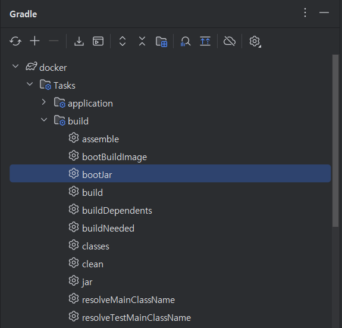

# 🐋 스프링 부트에서 도커로 배포 해보기

## 🐬 1. 프로젝트 jar 파일 만들기

### 방법 1
```
./gradlew build
```
- 터미널에 **./gradlew build** 명령어 입력

### 방법 2
- 오른쪽에 Gradle 클릭
- Tasks -> build -> bootjar 클릭
- 이렇게하면 프로젝트 폴더에 -> build -> libs에 jar 파일이 생김김

jar 파일 : 여러 개의 클래스 파일들과 관견 리소스 및 메타 데이터를 하나의 파일로 모아서 배포를 위해 만들어지 소프트웨어 페키지 파일 포멧 (jar은 zip으로 이루어진 압축파일)



## 🐬 2. Docker 파일 만들기
- 프로젝트 파일 최상단에 Dockerfile을 만든다. (Dockerfile을 토대로 설정을 해줌)

```
FROM openjdk:17
ARG JAR_FILE=build/libs/*.jar
COPY ${JAR_FILE} app.jar
ENTRYPOINT ["java","-jar","/app.jar"]
```

FROM: 기반이 되는 이미지를 의미하고, jdk 버전을 명시해주면 된다.
ARG: 컨테이너 내에서 사용할 수 있는 변수를 지정할 수 있다.
COPY: ARG의 JAR_FILE 변수를 컨테이너의 app.jar에 복사한다는 뜻
ENTRYPOINT: 컨테이너가 시작됐을 때 실행할 스크립트 명시

## 🐬 3. Dockerfile 빌드하기

```
docker build -t ex2 .
```

- docker build : Docker 이미지를 빌드하는 명령어
- -t ex2 : 빌드된 이미지의 **이름(ex2)과 태그** 지정(생략하면 기본적으로 latest로 설정)
- . : 현재 디랙터리를 빌드 컨텍스트로 사용
    - Dockerfile가 JAR 파일이 존재하는 위치에서 실행해야 함


## 🐬 4. 이미지 잘 올라갔는지 확인

```
docker images
```


## 🐬 5. docker 컨테이너 생성만들고 run하기기

```
docker run -d -p 8080:8080 --name inspiring_mendel ex2
```

docker run : 도커 컨테이너 실행
**-d** : 백그라운드(Detached mode)에서 실행
-p 8080:8080 : 호스트의 8080포트를 컨테이너의 8080포트에 매핑 
--name ex2-container : 컨테이너 이름을 ex2-container로 지정 (이름 지정 안하면 알아서 생성)
ex2 : 실행할 도커 이미지 이름 


## 🐬 6. 현재 실행 중인 컨테이너 목록 보기

```
docker ps
```

#### 모든 컨테이너 확인
```
docker ps -a
```


## 🐬 7. 불필요한 도터 이미지 삭제

### 🐟 7.1 특정 이미지 삭제
```
docker rmi ex2
```

- 이미지를 삭제 할 때 **해당 이미지**를 사용하는 컨테이너가 있어서 삭제할 수 없다.
- 이럴 경우 이미지를 제거 하기 위해서는 실행 중인 컨테이너를 중지 후 삭제해야 한다.

#### 컨테이너 ID로 중지
```
docker stop [컨테이너 ID]
```
#### 컨테이너 이름으로 중지
```
docker stop [컨테이너 이름]
```

#### 컨테이너 삭제
```
docker rm [컨테이너 ID] or [컨테이너이름]
```

### 🐟 7.2 사용하지 않는 모든 이미지 삭제 (불필요한 캐시 제거)

#### 모든 중지된 컨테이너 삭제
```
docker image prune -a
```
 
#### 사용하지 않는 모든 이미지 삭제
```
docker image prune -a
```
